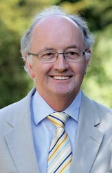

# Lab members

## Current Members

### Professor Chris Gilligan

**Head of group**

- [cag1@cam.ac.uk](mailto:cag1@cam.ac.uk)

Current research is focused on establishing and testing a theoretical framework that identifies the mechanisms that control invasion, persistence, scaling and variability of epidemics within changing agricultural and natural landscapes. Applications range from large-scale pandemics (sudden oak death, citrus canker, African cassava mosaic virus), through pesticide resistance and genetical control to biocontrol in sustainable agricultural systems, and to the design of intervention strategies for exotic pathogen threats to the UK.

The research involves a synthesis of epidemiological theory, population and evolutionary genetics, landscape ecology and economic modelling, drawing upon methods from statistical physics and Bayesian statistical inference, supported by a complementary experimental programme involving laboratory microcosms and collation of extensive field and regional data-sets to test the models.

For more details, [please visit the departmental website.](https://www.plantsci.cam.ac.uk/directory/gilligan-chris)

---

### Lawrence Bower

**Scientific IT Developer**

- [lb584@cam.ac.uk](mailto:lb584@cam.ac.uk)

Scientific programming support. Pipelines, HPC, plotting, user interfaces.

---

### Dr Ruairi Donnelly

**Postdoc**

- [rd501@cam.ac.uk](mailto:rd501@cam.ac.uk)
- [ORCID](https://orcid.org/0000-0001-7642-0317)
- [Google Scholar](https://scholar.google.com/citations?hl=en&user=PNMsCy0AAAAJ)

My research interests lie in ecology, epidemiology and evolution. At present I study the dynamics of a number of plant arboviruses. These include those that are "non-persistently" transmitted by aphids, as well as several important viruses of cassava that are transmitted by whitefly (cassava mosaic virus, cassava brown streak virus). I collaborate on empirical and modelling research with colleagues in the molecular plant pathology group of Prof. John Carr (Plant Sciences, Cambridge), and on field experiments in East Africa with colleagues at BecA ILRI (Nairobi).

---

### Sally Hames

**Group Administrator and PA**

- [sah57@cam.ac.uk](mailto:sah57@cam.ac.uk)

---

### Dr Tamas Mona

**Postdoc**

- [tm689@cam.ac.uk](mailto:tm689@cam.ac.uk)
- [ORCID](https://orcid.org/0000-0002-5797-1815)

Working as a weather modeller in the wheat rust forecasting project which is a collaboration between the Epidemiology and Modelling Group at the University of Cambridge, the UK Met Office, CIMMYT (International Maize and Wheat Improvement Centre) and the Ethiopian Institute of Agricultural Research. The project uses NAME to forecast the spread of these epidemics of wheat rust in near real-time to enable growers to take preventative action. The project grew from an initial analysis of pathways for long-distance dispersal of wheat rust spores extending from Southern and East Africa through the Middle East, West and South Asia.

---

### Dr Renata Retkute

**Postdoc**

- [rr614@cam.ac.uk](mailto:rr614@cam.ac.uk)
- [ORCID](https://orcid.org/0000-0002-3877-6440)

My research has focused on modelling and parametrisation of biological systems at different spatial and temporal scales, based on the experimental and observed data.

---

### Dr Jacob Smith

**Postdoc**

- [jws52@cam.ac.uk](mailto:jws52@cam.ac.uk)
- [ORCID](https://orcid.org/0000-0002-0079-4045)

With a background in climate science, I want to improve understanding of plant diseases dispersed by the wind. Wheat crops often suffer from wheat rust, a family of aerially dispersed fungal pathogens. Similarly, wheat blast is an emerging threat. Key to mitigating their impacts is the research and development of models equipped with appropriate processes, including Lagrangian dispersal models and full-landscape epidemiological models. In collaboration with others, my research brings these aspects together.

---

### Dr Yevhen Suprunenko

**Postdoc**

- [ys526@cam.ac.uk](mailto:ys526@cam.ac.uk)

Using methods of mathematics and physics I study complex dynamics of living organisms. I am fascinated with how living systems and groups of living organisms maintain their function and their existence, despite being open systems and being subject to continuous perturbations and fluctuations. In my research, I develop models and theoretical descriptions of such dynamics, focusing on underlying mechanisms, and on the role of spatially explicit dynamics, stochasticity, and time-variability.

I received my PhD in Theoretical Physics (2011, Lancaster University, UK). Before joining Epidemiology and Modelling group of Prof Chris Gilligan, I worked as a postdoc in Nonlinear and Biomedical Physics (2011-2014, and 2017-2018, Lancaster University, UK), and in Theoretical Ecology (2014 – 2017, University of Liverpool).

---

### Dr Rich Stutt

**Postdoc**

- [rs481@cam.ac.uk](mailto:rs481@cam.ac.uk)
- [ORCID](https://orcid.org/0000-0002-1765-2633)

My research is focused on large scale predictions for disease spread and management.

Current Projects

My current projects involve modelling the spread of the Ramorum disease epidemic (also known as Sudden Oak Death, caused by P. ramorum) in the UK, working with regulators to provide outputs including predictions of disease spread and the effect of management strategies. I am also involved in predicting the potential for future spread of Sudden Oak Death on the east coast of the USA, and looking at the effects of spread of citrus diseases at the state scale in Florida.

I am part of the production and deployment of a web based interactive utility to demonstrate the effect of control in realistic landscapes and additionally the development of a generic computational framework for stochastic simulation of spatial models of epidemics and developing a flexible, computationally-efficient suite of models for the analysis of disease spread and control in heterogeneous environments.

---

### Dr Cerian Webb

**Postdoc**

- [crw1005@cam.ac.uk](mailto:crw1005@cam.ac.uk)
- [ORCID](https://orcid.org/0000-0002-0640-3666)

I am a Mathematical Epidemiologist with a background in both plant and animal systems. I received a degree in Pure Mathematics from the University of York (1992) an MSc in Mathematical Biology from the University of Dundee (1993) and a PhD modelling crop growth and disease dynamics from the Department of Plant Sciences, University of Cambridge under the supervision of Professor Chris Gilligan and Dr Rik Werker. After completing my PhD I joined the veterinary epidemiology group at VLA-Weybridge where I developed models to investigate the dynamics of scrapie and likely efficacy of control policies. I have contributed to disease modelling internationally through involvement in an EU transmissible spongiform encephalopathies (TSEs) project and collaborations with Massey University, New Zealand. In 2000 I moved back to the University of Cambridge, although this time to the Vet School, as the Kirsten Rausing Research Fellow which enabled me to pursue more theoretical work investigating the role of animal movement networks in determining the dynamics of farm animal disease. 

Having taken a break from research (but not from lecturing and teaching) while my daughter went through primary school, I have found myself back in Plant Sciences where I work on mathematical models for a range of tree pests and pathogens. 

In addition to my research role, I lecture for the Part 1A Mathematical Biology course and am a lecturer on the Wellcome Trust 'Mathematical Models for Infectious Disease Dynamics' course. I regularly deliver courses on MATLAB for Biologists and have recently co-authored the textbook [“Introduction to MATLAB for Biologists”.](https://link.springer.com/book/10.1007/978-3-030-21337-4) 

As well as my research position in this group I am the Associate Lecturer in Mathematical Biology for Newnham College, Cambridge.

## Collaborators

---

### Dr Hola Adrakey

**Postdoc**

- [ha411@cam.ac.uk](mailto:ha411@cam.ac.uk)

Following the completion of my Master (Maitrise) in Mathematics from Lome in 2009, I worked briefly as a maths teacher in Lome before securing a scholarship to study mathematical sciences at AIMS (African Institute for Mathematical Sciences) in Cape Town (South Africa) in 2011. After completing this in 2012, I had an opportunity to begin a Ph.D. in Statistics at Heriot-Watt University (Edinburgh) with Gavin Gibson and George Streftaris titled "Control and Surveillance of Partially Observed Stochastic Epidemics in a Bayesian Framework " which is shortlisted for the Macfarlane Prize. Currently, I hold a research associate post in the Epidemiology and Modelling group at Cambridge University (UK).

My research interests lie in developing Bayesian methods to understand the dynamics of epidemic processes to provide insight in estimating disease burden. I am also interested in designing optimal control strategies so that they provide the greatest benefits in terms of disease reduction and developing new statistical tools to determine the most efficient ways of measuring their impact.

---

### Dr Marcel Meyer

**Postdoc**

- [mm2086@cam.ac.uk](mailto:mm2086@cam.ac.uk)

---

## Visiting Researchers

#### Alex Ferris

**Gates Intern and PhD student, Stanford University.**

## Former Members

- Dr Ciara Dangerfield
- Dr Clare Allen
- Dr Eleftherios Avramidis
- Dr Adam Hall
- Dr Viet Nguyen
- Dr Anna Szyniszewska
- Dr Daniel Bonnery
- Dr David Godding
