# Lab members

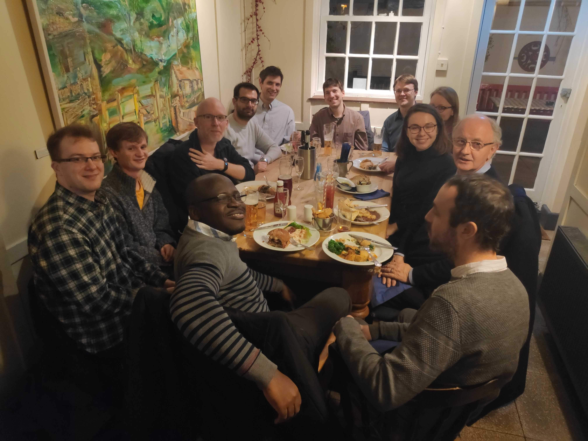

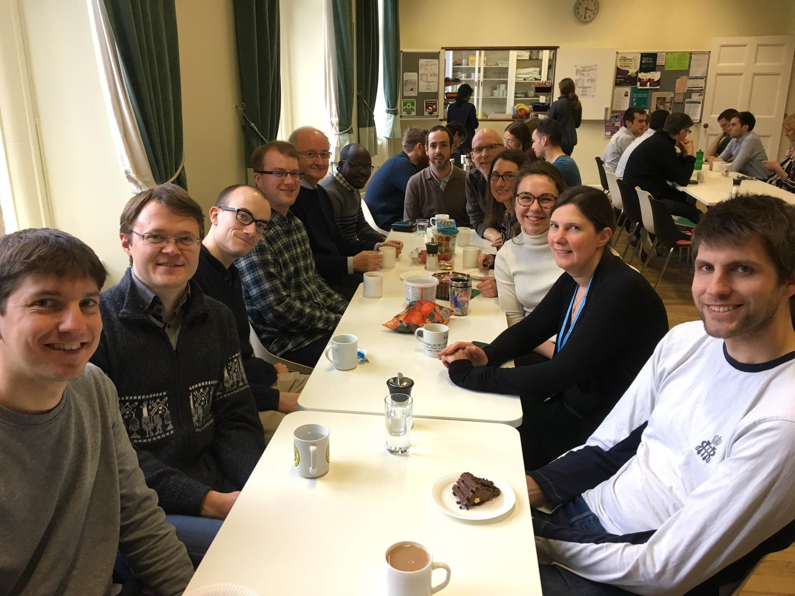

## Current Members

### Professor Chris Gilligan

**Head of group**

- [cag1@cam.ac.uk](mailto:cag1@cam.ac.uk)

Current research is focused on establishing and testing a theoretical framework that identifies the mechanisms that control invasion, persistence, scaling and variability of epidemics within changing agricultural and natural landscapes. Applications range from large-scale pandemics (sudden oak death, citrus canker, African cassava mosaic virus), through pesticide resistance and genetical control to biocontrol in sustainable agricultural systems, and to the design of intervention strategies for exotic pathogen threats to the UK.

The research involves a synthesis of epidemiological theory, population and evolutionary genetics, landscape ecology and economic modelling, drawing upon methods from statistical physics and Bayesian statistical inference, supported by a complementary experimental programme involving laboratory microcosms and collation of extensive field and regional data-sets to test the models.

For more details, [please visit the departmental website.](https://www.plantsci.cam.ac.uk/directory/gilligan-chris)

---

### Dr Hola Adrakey

**Postdoc**

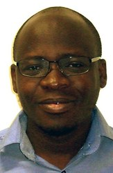

- [ha411@cam.ac.uk](mailto:ha411@cam.ac.uk)

Following the completion of my Master (Maitrise) in Mathematics from Lome in 2009, I worked briefly as a maths teacher in Lome before securing a scholarship to study mathematical sciences at AIMS (African Institute for Mathematical Sciences) in Cape Town (South Africa) in 2011. After completing this in 2012, I had an opportunity to begin a Ph.D. in Statistics at Heriot-Watt University (Edinburgh) with Gavin Gibson and George Streftaris titled "Control and Surveillance of Partially Observed Stochastic Epidemics in a Bayesian Framework " which is shortlisted for the Macfarlane Prize. Currently, I hold a research associate post in the Epidemiology and Modelling group at Cambridge University (UK).

My research interests lie in developing Bayesian methods to understand the dynamics of epidemic processes to provide insight in estimating disease burden. I am also interested in designing optimal control strategies so that they provide the greatest benefits in terms of disease reduction and developing new statistical tools to determine the most efficient ways of measuring their impact.

---

### Lawrence Bower

**Front End Developer**

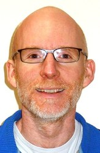

- [lb584@cam.ac.uk](mailto:lb584@cam.ac.uk)

test edit

---

### Dr Ruairi Donnelly

**Postdoc**

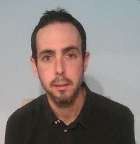

- [rd501@cam.ac.uk](mailto:rd501@cam.ac.uk)

---

### David Godding

**PhD Student**

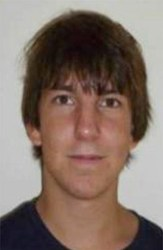

- [dsg38@cam.ac.uk](mailto:dsg38@cam.ac.uk)

---

### Dr Adam Hall

**Postdoc**

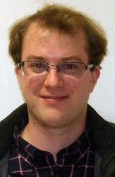

- [ajh221@cam.ac.uk](mailto:ajh221@cam.ac.uk)

---

### Sally Hames

**Group Administrator and PA**

- [sah57@cam.ac.uk](mailto:sah57@cam.ac.uk)

---

### Dr Marcel Meyer

**Postdoc**

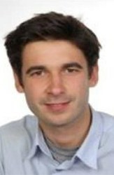

- [mm2086@cam.ac.uk](mailto:mm2086@cam.ac.uk)

---

### Dr Viet Nguyen

**Postdoc**

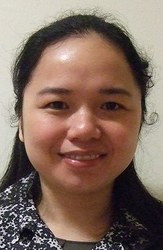

- [van25@cam.ac.uk](mailto:van25@cam.ac.uk)

---

### Dr Yevhen Suprunenko

**Postdoc**

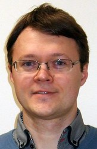

- [ys526@cam.ac.uk](mailto:ys526@cam.ac.uk)

Using methods of mathematics and physics I study complex dynamics of living organisms. I am fascinated with how living systems and groups of living organisms maintain their function and their existence, despite being open systems and being subject to continuous perturbations and fluctuations. In my research, I develop models and theoretical descriptions of such dynamics, focusing on underlying mechanisms, and on the role of spatially explicit dynamics, stochasticity, and time-variability.

I received my PhD in Theoretical Physics (2011, Lancaster University, UK). Before joining Epidemiology and Modelling group of Prof Chris Gilligan, I worked as a postdoc in Nonlinear and Biomedical Physics (2011-2014, and 2017-2018, Lancaster University, UK), and in Theoretical Ecology (2014 – 2017, University of Liverpool).

---

### Dr Rich Stutt

**Postdoc**

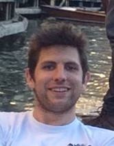

- [rs481@cam.ac.uk](mailto:rs481@cam.ac.uk)

---

### Dr Anna Szyniszewska

**Postdoc**

- [ams293@cam.ac.uk](mailto:ams293@cam.ac.uk)

---

### Dr Cerian Webb

**Postdoc**

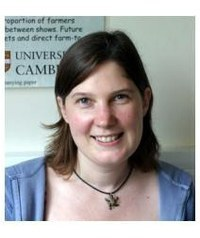

- [crw1005@cam.ac.uk](mailto:crw1005@cam.ac.uk)

I graduated with a degree in pure Mathematics from the University of York (1992). This was followed by an MSc in Mathematical Biology from the University of Dundee (1993) led by Professor Brian Sleeman. In1997 I completed a PhD at the Department of Plant Sciences, University of Cambridge, modelling crop growth and disease dynamics under the supervision of Professor Chris Gilligan and Dr Rik Werker. I then worked at VLA-Weybridge where I developed models to investigate the dynamics of scrapie and the likely efficacy of control policies. In 2000 I returned to Cambridge where I took up a postdoctoral position in the Department of Veterinary Medicine modelling farm animal diseases. I currently lecture on the part IA Mathematical Biology course at the University of Cambridge and on the Wellcome Trust 'Mathematical Models for Infectious Disease Dynamics' course.

---

## Visiting Researchers

#### Alex Ferris

**Gates Intern and PhD student, Stanford University.**

## Former Members

- Dr Ciera Dangerfield
- Dr Clare Allen
- Dr Eleftherios Avramidis
