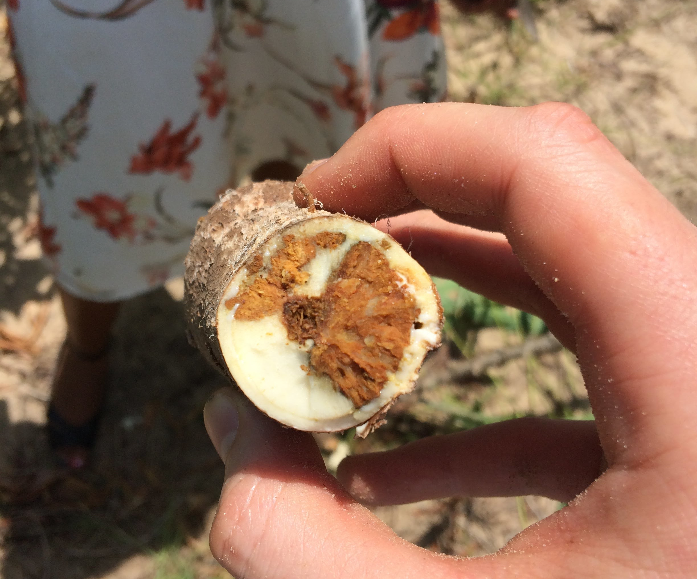

# Research

## [Cassava Brown Streak Disease](../research/cbsd.md)

In 2004, Cassava brown streak disease (CBSD) was observed near Kampala, Uganda. Since 2004, it has spread widely throughout previously uninfected regions and threatens production in Central and West Africa. 

Our research focusses on predicting future spread and optimal management strategies to counteract spread in endemic and currently uninfected regions. For a summary of our latest research on CBSD, please click here.

### Project members

## Wheat Stem Rust

Some text

