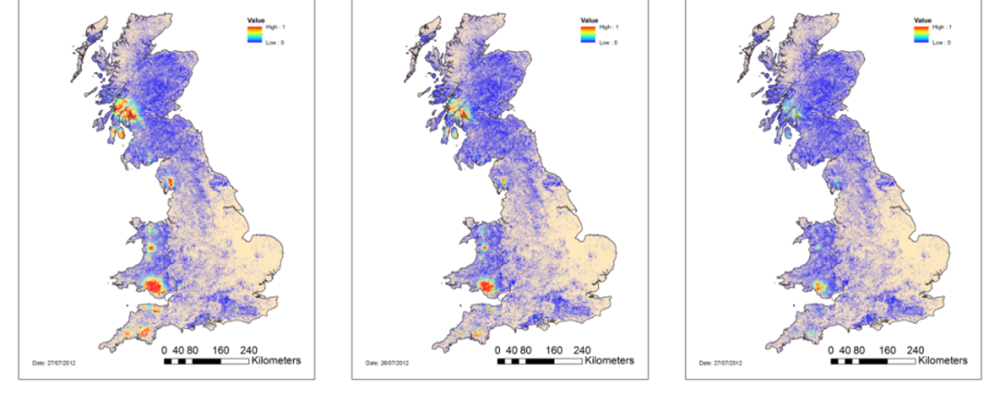
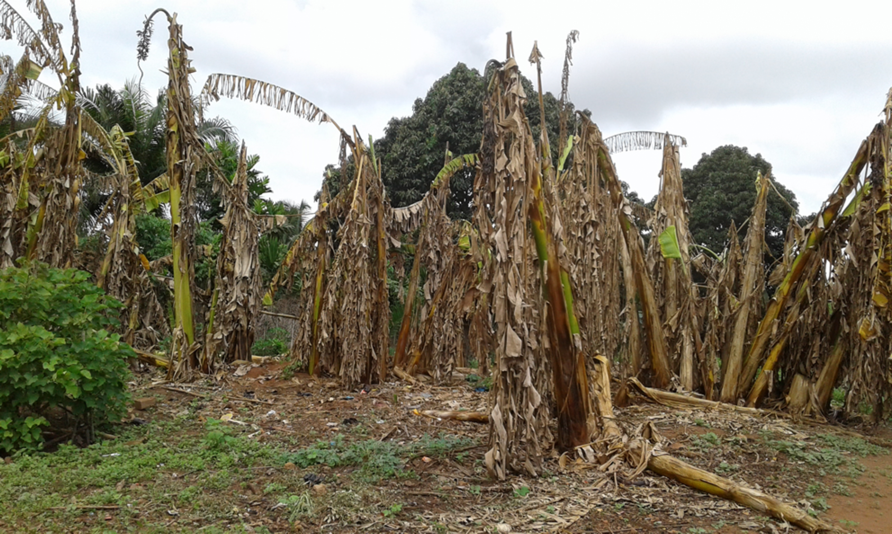

# Research

**For the latest list of our publications, please [visit Google Scholar.](https://scholar.google.co.uk/citations?hl=en&user=GriJOGgAAAAJ&view_op=list_works&sortby=pubdate)**

## [Cassava Brown Streak Disease](research/cbsd.md)

**Location: Sub-Saharan Africa**

In 2004, Cassava brown streak disease (CBSD) was observed near Kampala, Uganda. Since 2004, it has spread widely throughout previously uninfected regions and threatens production in Central and West Africa. 

Our research focusses on predicting future spread and optimal management strategies to counteract spread in endemic and currently uninfected regions. For more details, [please click here](research/cbsd.md).

### Project members

- David Godding
- Dr Rich Stutt
- Dr Anna Szyniszewska
- Alex Ferris
- Professor Chris Gilligan

## Wheat Stem Rust

**Location: Ethiopia**

- Ethiopia Early warning system
- Long term wheat disease forecasting

### Project members

- Dr Marcel Meyer
- Dr James Cox
- Dr Clare Allen
- Dr Rich Stutt
- Dr Viet Nguyen
- Professor Chris Gilligan

## DEFRA Quantitative Modelling

**Location: UK**

### Pathosystems

- Ramorum
- Chalara
- OPM
- EAB
- Gall Wasp
- Sweet Chestnut blight

### Project members

- Dr Rich Stutt
- Dr Cerian Webb
- Dr Ciara Dangerfield
- Dr Matt Castle
- Dr Andrew Craig
- Dr Yevhen Suprunenko
- Professor Chris Gilligan

## Citrus Huanglongbing

**Location: USA, Australia**

### Project members

- Dr Rich Stutt
- Dr Viet Nguyen
- Professor Chris Gilligan

## Banana Bunchy Top Virus

**Location: Benin, Nigeria, Australia**

### Project members

- Dr Hola Adrakey
- Professor Chris Gilligan

## Crop growth dynamics

### Project members

- Dr Adam Hall
- Professor Chris Gilligan

## Theoretical vector dynamics

### Project members

- Dr Ruairi Donnelly
- Professor Chris Gilligan

## Computing

- Spatially-explicit stochastic dynamic epidemiological simulations
- Deal with large datasets
- Over 200TB of storage
- Environmental suitability calculation
- Fast simulations on large landscapes

### Project members

- Dr Rich Stutt
- Dr Adam Hall
- Lawrence Bower
- Dr Eleftherios Avramidis
- Professor Chris Gilligan

